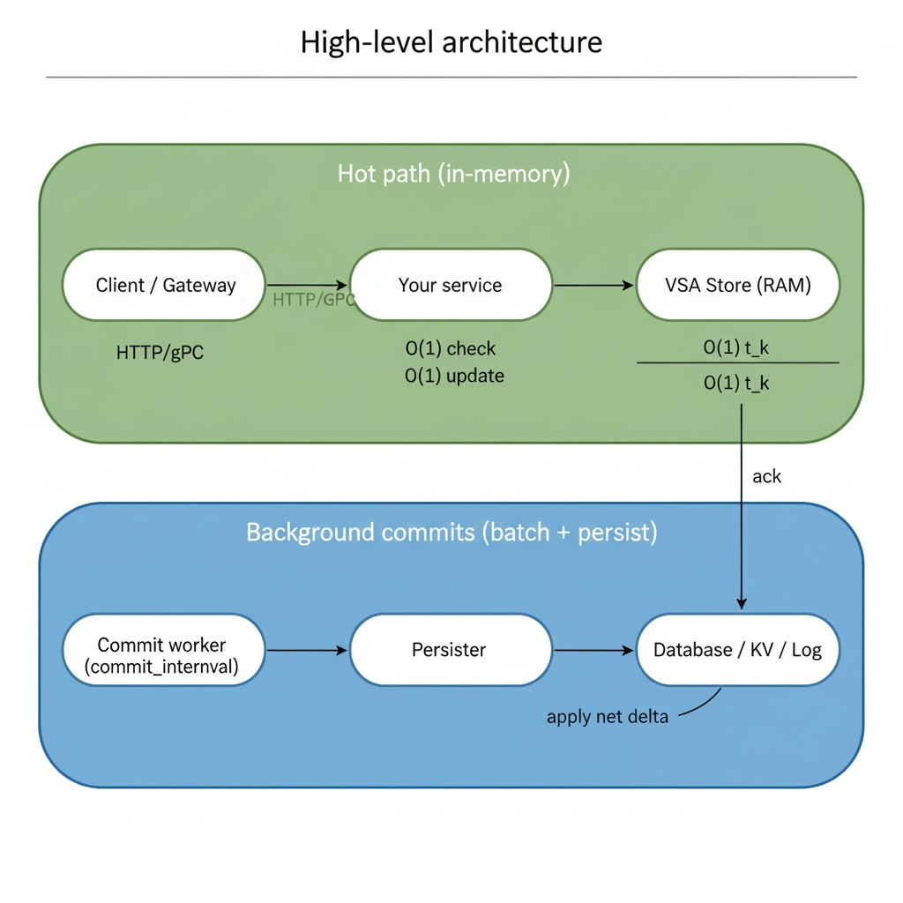

# VSA FAQ (Frequently Asked Questions)

This FAQ explains the Vector–Scalar Accumulator (VSA) approach in plain language and gives practical guidance for engineers and non‑specialists.

If you’re new here, start with the project overview in the root README: [../readme.md](../readme.md).

---

## What is VSA in one sentence?
VSA admits and tracks requests entirely in memory and only persists the net effect in the background — “Commit information, not traffic.”

- Scalar (S): the stable, persisted base value (e.g., your quota).
- Vector (A_net): the in‑memory net change since the last commit (fast, ephemeral).
- Available = S − |A_net|

This lets you answer “how many requests remain?” instantly from RAM without a database read.

---

## Why is this useful?
Because durable writes (DB/Redis/network) are slow and expensive compared to RAM. In real systems, many updates cancel out (reserve → cancel). VSA allows that “noise” to cancel in memory and writes only the net, cutting datastore calls by orders of magnitude.

From our apples‑to‑apples benchmarks (32 goroutines, 128 keys, write_delay=50–200 µs):
- Token/Leaky (per‑request I/O): ~25–27k ops/sec; ~50–53k DB calls/sec.
- VSA: ~16–20M ops/sec (hot path); ~0.8k–1.3k DB calls/sec total across all keys; ~13k–28k ops per DB call.

---

## Does VSA replace my database?
No. VSA is a front‑end filter and aggregator for high‑frequency counters. It reduces write amplification and hot‑row contention. You still persist state — just less often and in batches. For a full audit trail or replay, pair VSA with a durable log (Kafka/Kinesis).

---

## How does VSA answer “remaining” without querying the DB?
VSA keeps two numbers per key in RAM:
- S (scalar) — last persisted base.
- A_net (vector) — uncommitted net change.

Remaining = S − |A_net|, computed in O(1) time. After a background commit, VSA folds A_net into S in memory so the formula stays correct without re‑reading the DB.

---

## What are the main knobs and what do they do?
These control cost vs. freshness. The same concepts exist in the harness and in the API demo.

- commit_interval (e.g., 1–5 ms): how often the background loop checks keys.
- threshold (high watermark): commit when |A_net| ≥ threshold.
- low_threshold (low watermark / hysteresis): after committing, wait until |A_net| ≤ low_threshold to “re‑arm” another threshold commit; prevents flapping. A good default is threshold/2.
- commit_max_age (e.g., 10–20 ms): if a key hasn’t changed for this long and has a non‑zero remainder, commit anyway to keep the persisted view fresh during light traffic.

Practical starting points (128 keys):
- Balanced default: commit_interval=1ms, threshold=192, low_threshold=96, commit_max_age=20ms → ~1.1k–1.3k DBCalls/sec total.
- Lower DB pressure: commit_interval=5ms, threshold=256, low_threshold=128, commit_max_age=20ms → ~0.8–1.0k DBCalls/sec total.
- Fresher storage state: commit_interval=1ms, threshold=128, low_threshold=64, commit_max_age=10–15ms → ~1.3k DBCalls/sec total.

See: [benchmarks/harness/README.md](../benchmarks/harness/README.md) for detailed sweeps and interpretation.

---

## What happens on crash? Do I lose data?
Uncommitted A_net lives in RAM and can be lost on crash. You control the risk window with:
- Lower thresholds (commit smaller nets more often).
- Smaller commit_max_age (force periodic commits even below threshold during idle periods).
- Optional WAL/event log: append request events to a durable stream and reconstruct if needed.

For many quota/rate‑limit scenarios, a 10–20 ms freshness window is acceptable and yields large cost savings.

---

## How is VSA different from token bucket / leaky bucket?
- Token/Leaky: typically read + write per request to a datastore → higher per‑request latency and many DB calls.
- VSA: admits in memory; writes only the net effect periodically → near‑zero hot‑path latency and far fewer DB calls. You still enforce limits via TryConsume and expose remaining via Available.

---

## How is this different from Uber’s `go.uber.org/ratelimit`?
Uber’s library is a local pacing limiter that sleeps to keep you under N ops/sec. It has no persistence or “remaining” concept. VSA is a stateful, in‑memory aggregator with batched persistence. Use Uber’s limiter to smooth callers; use VSA for accurate remaining and minimal datastore I/O.

---

## What does “0.000 µs latency” mean in some outputs?
On modern CPUs, VSA’s hot path is a handful of atomic operations. The median can be below the clock’s reporting tick, so percentiles print as 0.000 µs. The harness includes exact nanosecond values in the one‑line Summary (p50_ns/p95_ns/p99_ns) for plotting.

---

## How common is “churn traffic” (updates that cancel out)?
Very common in real systems where actions are reversible or short‑lived:
- Resource pools (acquire/release): often 90–100% churn over seconds.
- Carts/reservations: 30–70% cancel/expire.
- Toggles (like/unlike): 5–20% short‑term reversals.
- Retries/duplicates: low single digits, higher during incidents.

Churn is where VSA shines — only the net survives to persistence.

---

## How do I deploy this in the cloud? Do I need HTTP or a queue?
Patterns (pick one):
- In‑process library (fastest): call TryConsume in your gateway/service. Background committer runs in the same process.
- Local sidecar: a tiny gRPC/UDS daemon on the host; apps talk locally.
- Central service: a shared rate‑limit service (ensure key affinity and horizontal scale).

Queues/logs are optional. Use a durable log (Kafka/Kinesis/Pub/Sub) if you need audit/replay or cross‑system consumers. VSA can admit from RAM while you dual‑write events to the log.

Multi‑node tips:
- Key affinity: route the same key to the same node when possible to maximize batching.
- Idempotent commits: persist deltas with a batch_id/version so duplicates don’t double‑count.
- Optional sharding of commit workers to spread background load.

---

## Can I use VSA in both HTTP and non‑HTTP contexts?
Yes. VSA is a library and pattern, not tied to a transport. You can:
- Use it in‑process in any service or CLI by calling the Go API directly. See: `pkg/vsa` and `internal/ratelimiter/core`.
- Expose it over HTTP or gRPC (as in `cmd/ratelimiter-api`) or via a local sidecar/daemon over gRPC/UDS.
- Drive it from queues/streams, batch jobs, cron, or stream processors: the hot path remains in memory; the background worker commits deltas.

The only requirements are a place to run the in‑memory store and a persister implementation for your datastore.

---

## Can I enforce multiple windows at once (e.g., 100/minute and 1000/hour simultaneously)?
Yes. Model each window as a separate counter and admit only if all pass for the key.
Options:
- Separate keys per window (e.g., `user:minute` and `user:hour`), each with its own VSA state and thresholds.
- Or wrap per‑key state that holds multiple VSAs and check them in order (fail fast).

Pseudo‑code sketch:
```text
ok1 := minuteLimiter.TryConsume(key, 1)
ok2 := hourLimiter.TryConsume(key, 1)
allowed := ok1 && ok2
remaining_min := minuteLimiter.Available(key)
remaining_hr := hourLimiter.Available(key)
```
Tips:
- Keep commit thresholds proportional to each window’s rate so commits stay efficient.
- For sliding windows, you can reset/reseed scalars (S) periodically or model them as rolling quotas in persistence.

---

## Can VSA help with sudden spikes in a distributed setup? What about prediction/prefetch?
VSA absorbs short bursts locally because the hot path is in RAM, but for large distributed spikes consider:
- Key ownership/affinity: route a key to a single active owner to maximize batching and avoid double‑spend.
- Surge headroom: allocate a small per‑key surge buffer in S (or permit temporary oversubscription) and let the worker reconcile quickly via lower thresholds and a smaller `commit_max_age` during spikes.
- Adaptive knobs: lower `threshold` and `commit_max_age` automatically when the burn rate accelerates, then relax when traffic cools.
- Pre‑allocation to nodes: if quota is global, pre‑slice budgets to nodes and periodically rebalance (or borrow) using idempotent commits.
- Backpressure: if the persister/DB lags, raise thresholds or shed load; expose metrics to drive autoscaling.
- Durability: if the spike risk window is unacceptable, add a WAL/event log so uncommitted A_net can be reconstructed.

Note: “Predictive prefetch” generally means proactively increasing S or pre‑slicing budgets based on trend. It’s safe if changes are idempotent and reconciled by the background worker; avoid double‑counting by using batch IDs or commutative adds in the datastore.

---

## Where do I configure these knobs in this repo?
- Benchmark harness flags (CLI): see [../benchmarks/harness/README.md](../benchmarks/harness/README.md).
- API demo flags (service): see [../cmd/ratelimiter-api/readme.md](../cmd/ratelimiter-api/readme.md). It supports `-commit_threshold`, `-commit_low_watermark`, `-commit_interval`, `-commit_max_age`, plus eviction knobs.

Quick start (API demo):
```sh
go run ./cmd/ratelimiter-api \
  -http_addr=":8080" \
  -rate_limit=1000 \
  -commit_threshold=50 \
  -commit_low_watermark=25 \
  -commit_interval=100ms \
  -commit_max_age=20ms
```

---

## How do I benchmark fairly (apples‑to‑apples)?
Use the provided scripts to compare variants under the same persistence delay:
- POSIX baseline: `sh benchmarks/harness/run_baselines.sh`
- Windows PowerShell: `pwsh benchmarks/harness/run_baselines.ps1`

Look at these TSV columns:
- DBCalls/sec and LogicalWrites/sec (cost to your datastore)
- Ops/sec/key (per‑key throughput)
- OpsPerDBCall (batching effectiveness)

Automated sweeps: `sh benchmarks/harness/sweep.sh`

---

## How do I capture CPU/heap profiles?
The harness has built‑in pprof support and a helper script.
- One‑command helper: `sh benchmarks/harness/capture_pprof.sh`
- Manual: run the harness with `-pprof=true -duration=60s` and fetch profiles from `http://127.0.0.1:6060/debug/pprof/...`.

Tip: For cleaner profiles, disable latency sampling: `-max_latency_samples=0 -sample_every=0`.

---

## Does VSA handle concurrency correctly?
Yes. Updates are striped across per‑CPU‑like slots with atomics, and TryConsume uses a tiny critical section to gate consumption atomically. Microbenchmarks show ~8–9 ns/op uncontended and ~36–41 ns/op under extreme single‑key contention, with zero allocations.

---

## When should I not use VSA?
- You must durably write every single request (strict audit per op).
- You require immediate read‑after‑write from the central datastore for each request.
- Your workload is purely monotonic and tiny (no batching benefit) — a simple atomic/in‑memory limiter might be enough.

---

## What about memory usage?
VSA holds a small, bounded in‑flight delta per key. Long duration benchmarks can show inflated allocator stats if latency sampling is heavy. The harness includes a reservoir sampler and flags to bound/disable sampling.

Eviction: the demo uses `-eviction_age` and `-eviction_interval` to drop idle keys from memory; it also does a final commit on eviction if a remainder exists.

---

## What persistence stores are supported?
The demo uses a mock persister for clarity. In production, use any store that supports idempotent upserts:
- Postgres/SQL (UPSERT with batch_id)
- DynamoDB/Spanner
- Redis with Lua guards

The key is idempotency: applying the same batch twice should not double‑count.

---

## Visual guide: VSA architecture and data flow

Below are simple diagrams to orient new readers. They illustrate how the hot path stays in RAM, how commits happen in the background, and common deployment patterns.

### A) High‑level architecture (hot path vs background)
<p align="center">
  
</p>

Key ideas:
- Hot path (green) never waits on the database; it’s pure in‑memory work.
- Background (blue) batches and commits only the net effect to the datastore.

### B) Data flow sequence (when a request arrives)
<p align="center">
  
</p>

### C) Deployment patterns
<p align="center">
  
</p>

Notes:
- Prefer in‑process for the lowest latency. Sidecar is great for multi‑language teams. A central service requires hashing/affinity by key to keep batching effective.

---

## For developers: Integrating VSA with your stack

This section shows practical ways to pair VSA with other technologies. Use it as a library inside your service, expose it via gRPC/HTTP as a sidecar, or combine it with queues and databases for durability and analytics.

### 1) Use VSA as a Go library (fastest, in-process)
```text
import (
    "fmt"
    "vsa/pkg/vsa"
)

func allow(key string, v *vsa.VSA) bool {
    if !v.TryConsume(1) { // gate atomically in RAM
        return false
    }
    fmt.Println("remaining:", v.Available())
    return true
}

// init per key (e.g., from config/DB at startup)
v := vsa.New(1000)
_ = allow("alice", v)
```
- What you get: nanosecond hot path, exact “remaining” from RAM.
- Add a background committer (below) to persist the net effect.

### 2) Embed Store + Worker in your Go service
Use the production-style store/worker from `internal/ratelimiter/core`.
```text
import (
    "time"
    "vsa/internal/ratelimiter/core"
)

store := core.NewStore(1000) // scalar S per new key
worker := core.NewWorker(
    store,
    core.NewMockPersister(),   // replace with your DB adapter
    192,       // commit_threshold (high watermark)
    96,        // lowCommitThreshold (hysteresis)
    1*time.Millisecond,  // commitInterval
    20*time.Millisecond, // commitMaxAge
    30*time.Minute,      // evictionAge
    5*time.Minute,       // evictionInterval
)
worker.Start()
// request path
u := store.GetOrCreate("alice")
if u.TryConsume(1) { /* OK */ } else { /* 429 */ }
// on shutdown
worker.Stop()
```
- Files: [`internal/ratelimiter/core/store.go`](../internal/ratelimiter/core/store.go), [`internal/ratelimiter/core/worker.go`](../internal/ratelimiter/core/worker.go).
- Demo server: [`cmd/ratelimiter-api`](../cmd/ratelimiter-api/readme.md).

### 3) Sidecar/daemon via gRPC (polyglot services)
Run VSA as a local daemon per host/Pod and call it over gRPC/UDS.
- Proto sketch:
  - `rpc CheckAndConsume(CheckReq){ returns(CheckResp) }`
  - `CheckReq{ string key; int64 units; }`
  - `CheckResp{ bool allowed; int64 remaining; }`
- Handler pseudocode:
```text
func (s *Server) CheckAndConsume(ctx context.Context, r *Req) (*Resp, error) {
    v := store.GetOrCreate(r.Key)
    if !v.TryConsume(r.Units) {
        return &Resp{Allowed:false, Remaining:v.Available()}, nil
    }
    return &Resp{Allowed:true, Remaining:v.Available()}, nil
}
```
- Pros: one implementation for many languages; hot path still local.

### 4) Pair with a durable log (Kafka/Kinesis) and a DB
- Inline request path:
  1) Admit with VSA (`TryConsume`).
  2) Optionally append event to a durable log for audit/replay.
- Background:
  - Commit net deltas from the worker to your database with idempotency.
- Recovery:
  - Rebuild scalars by replaying the log or via periodic snapshots.

### 5) Persistence adapters (idempotent upserts)
- Postgres (UPSERT with `batch_id`):
```sql
INSERT INTO vsa_commits(key, delta, batch_id, committed_at)
VALUES ($1,$2,$3,now())
ON CONFLICT (batch_id) DO NOTHING;  -- idempotent
UPDATE limits SET scalar = scalar - $2, updated_at=now() WHERE key=$1;
```
- Redis (Lua, guard on `batch_id`): store `seen:{batch_id}` with TTL; apply `HINCRBY` only if unseen.
- DynamoDB (conditional write): `UpdateItem` with `attribute_not_exists(batch_id)` to avoid double-apply.

### 6) API gateways and proxies
- Envoy: implement the Rate Limit Service (RLS) or ext_authz adapter that calls the local VSA.
- NGINX/Ingress: use a small sidecar and talk over localhost (Unix socket) from njs/Lua or upstream module.
- Key affinity: hash on `{tenant}:{user}` so the same key lands on the same node to maximize batching.

### 7) Kubernetes & ops tips
- Sticky routing by key (LB hash policy) → better batching, lower cross-node chatter.
- Scale on CPU plus `db_calls_per_sec` from your persister metrics.
- Expose Prometheus metrics: `vsa_commits_total`, `vsa_db_calls_total`, `vsa_commit_interval_seconds`, `vsa_age_since_last_commit_seconds`, `vsa_available` (samples).

### 8) Mapping harness → service flags
- Harness VSA flags: `-threshold`, `-low_threshold`, `-commit_interval`, `-commit_max_age`.
- API demo flags: `-commit_threshold`, `-commit_low_watermark`, `-commit_interval`, `-commit_max_age`.
- Recommended starting points (128 keys):
  - Balanced: `commit_interval=1ms, commit_threshold=192, commit_low_watermark=96, commit_max_age=20ms`.

---

## How do I tell if VSA is actually removing write noise?

For a step‑by‑step guide with live console screenshots and Prometheus metric names, see:
- internal/ratelimiter/telemetry/readme.md
  ([link](../internal/ratelimiter/telemetry/readme.md))

Quick essentials:
- Primary KPIs to watch (windowed):
  - vsa_write_reduction_ratio — target ≥ 0.95 (with commit_threshold=50 you should see ~0.98 under steady load).
  - vsa_rows_per_batch (histogram) — p50 near your threshold; p95 not far below it.
  - vsa_churn_ratio — ≈1.0 for monotonic consumption; >1.5 indicates noisy/oscillatory traffic.
- Enable metrics without Prometheus (prints to your server terminal):
  - Flags: --churn_metrics=true --churn_log_interval=15s --churn_sample=1.0
  - Optional: --churn_top_n=50 to list top keys; --metrics_addr=:9090 to expose /metrics.
  - Tip (Windows/IDE consoles): set env VSA_CHURN_LIVE=0 for clean periodic lines; set NO_COLOR=1 to disable colors.
- Core batching knobs that influence “noise removal” (fewer writes):
  - --commit_threshold (higher → fewer writes, older persisted view)
  - --commit_low_watermark (hysteresis; usually ~threshold/2)
  - --commit_interval (how often the worker checks keys)
  - --commit_max_age (forces a commit of small remainders during idle periods)

Example (Windows PowerShell):
```
go run .\cmd\ratelimiter-api --http_addr=:8080 --rate_limit=1000 --commit_threshold=50 --churn_metrics=true --churn_log_interval=15s --churn_sample=1.0
```
Interpretation cheatsheet:
- If vsa_write_reduction_ratio drops (< 0.90 sustained): your batches are too small/too frequent — raise commit_threshold, relax commit_max_age, or add key affinity so hot keys don’t split across replicas.
- If vsa_rows_per_batch p50 is low: same as above; also check for multi‑replica traffic without affinity.
- If vsa_churn_ratio rises (> 1.5) but write_reduction stays high: VSA is successfully coalescing noisy traffic.

---

## Glossary
- Scalar (S): persisted base value.
- Vector (A_net): in‑memory net since last commit.
- Available: S − |A_net|, the real‑time remaining budget.
- Threshold / Low threshold: high/low watermarks controlling commit cadence.
- Max age: freshness limit to commit during idle periods.
- Churn: fraction of operations that cancel out within a time window.


## Useful links in this repo
- Project overview: [../readme.md](../readme.md)
- Benchmark harness: [../benchmarks/harness/README.md](../benchmarks/harness/README.md)
- API demo: [../cmd/ratelimiter-api/readme.md](../cmd/ratelimiter-api/readme.md)
- Test script: [../scripts/test_ratelimiter.sh](../scripts/test_ratelimiter.sh)
- VSA engine code: [../pkg/vsa/vsa.go](../pkg/vsa/vsa.go)
- Background worker/store: [../internal/ratelimiter/core](../internal/ratelimiter/core)

If you have additional questions you’d like answered here, please open an issue or PR!


---